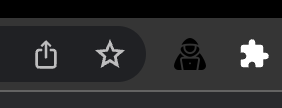
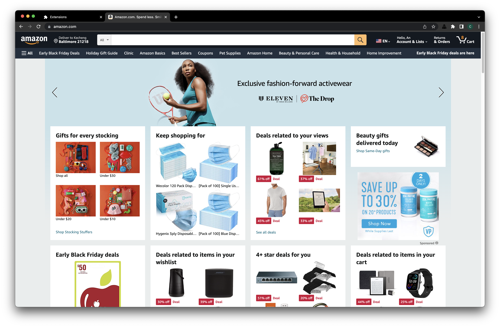
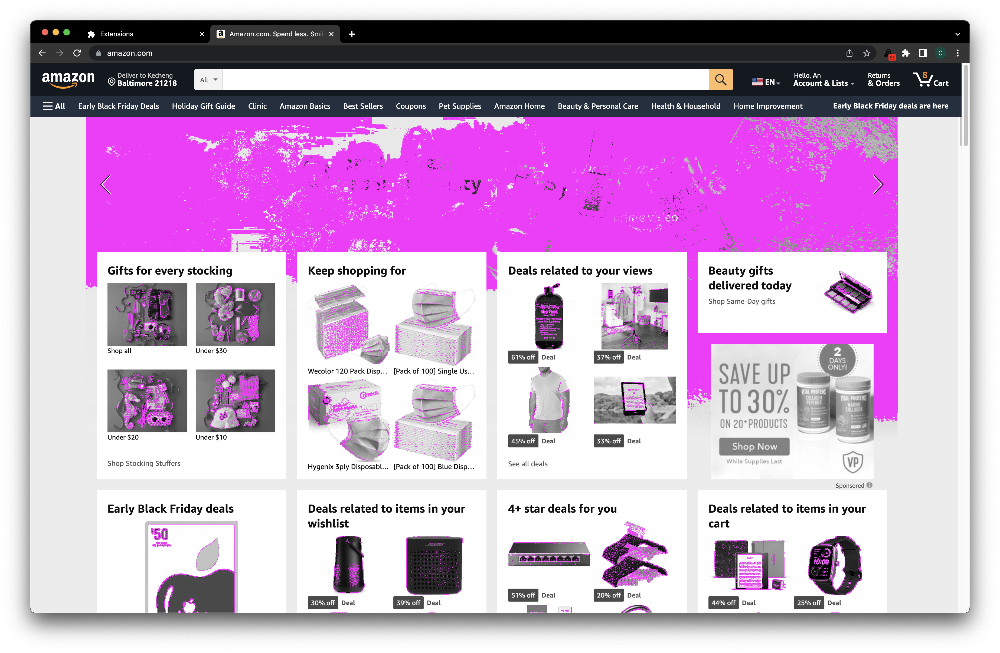
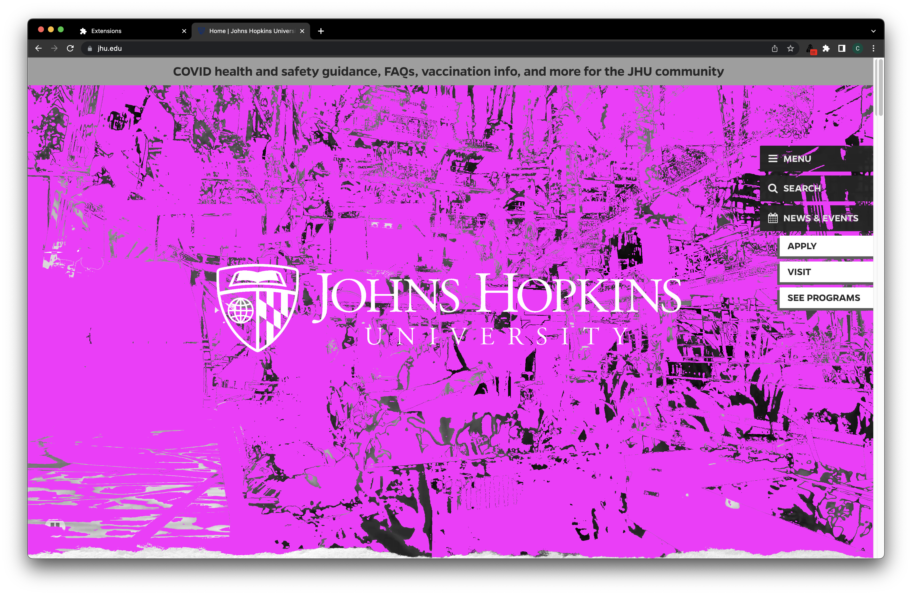

# Tabnabbing Detector Extension

## Instructions to run

1. Go to `chrome://extensions/`
2. Turn on Developer mode
3. Click on Load unpacked and browse to `./tabnabbingDetector/`, Select this folder
4. Pin this extension so you can see alarm in the taskbar. The extension will start to work automatically.

## How it works

When it detect that any website changes (Resemble MisMatchPercentage < 1)

 - the differences in the page will be colored with purple. Unchanged region will be greyscaled.
- the extension icon will have a red badge warning

 

When it does not detect any changes, no badge warning and website coloring will be applied.

 

## Example Screenshots 1

 - before leaving the tab

 - after leaving the tab

 

 - two view differences
    - notice that the banner has most highlighted color because the banner change
    - also notice that the extension icon in the task bar (on the top right) has a new red badge to alarm the user

## Example Screenshots 2

- before leaving the tab

- after leaving the tab

- two view differences
   - notice that the background video region is highlighted. The top banner and the white labels on the right remain uncolored

